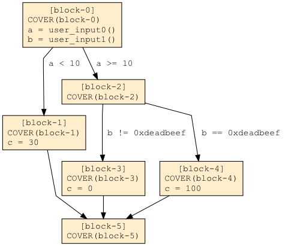
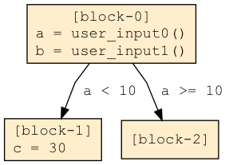
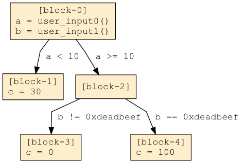

% Fuzzing, Symbolic Execution, and Finding Vulnerabilites in Binary Applications

# What is Fuzzing

Fuzzing is the process of testing an application for bugs by forcing the application to process different inputs, and observing the application for abnormal behavior. Fuzzing has become a popular method across multiple disciplines and organizations for discovering problems in software.

Fuzzing differs sharply from traditional testing frameworks, where developers manually implement tests to test code. Manually-generated tests offer the developer great fidelity in how to test their code, with a trade-off that only the tests imagined and implemented by the developer are run. Fuzzing generates hundreds of thousands, to millions of inputs, and runs these over the program, testing functionality and edge-cases developers don't imagine, or simply don't have time to implement themselves.

## Basic Vocabulary

We will begin by establishing common vocabulary.

  * **Corpus** - A set of inputs.
  * **Harness** - A harness is a special-purpose program, created to better test code or another application.
  * **Input** - Input refers to data generated by the fuzzer to run within a program. A program may read configuration files, or receive various user inputs, but within the context of fuzzing input refers only to the input generated by the fuzzer and used to test the program. The Input changes each time the fuzzer runs.
  * **Invoke** - To run a program over a given input.
  * **Program Under Test** - The Program Under Test is the program being tested by the fuzzer.
  * **Program** - Program can refer to a Program Under Test, or harness, depending on context.
  * **Test Case** - A synonym for input.

## The basic components of a fuzzer.

All fuzzers are composed of a few basic components.

  * **Input Generation** - All fuzzers have a way of generating input to feed into the program.
  * **Program Invocation & Observation** - All fuzzers have a way to invoke the program under test, feed fuzzer-generated input into that program, and observe the program for errors.

### Input Generation

There are three primary methods of input generation: Random Data, Generation-Based, and Mutation-Based.

#### Random Data

The most basic form of fuzzing creates random data, and feeds this data into a program. This method is considered to be largely ineffective. Often times, when a fuzzer has no data or understanding of the format for the input, random fuzzing will be used. As we will see in later sections, advanced analysis tools can begin with random data and move towards more sophisticated input generation methods.

#### Generation-Based

Generation-based input generation uses a specification of the format for input, and creates inputs which meet this specification. This method can help quickly test whether a program correctly parses an input according to a specification, but may fall short when a program's parser does not correctly parse the specification, the specification is incomplete, or the specification becomes outdated.

Fuzzers generate tests through a variety of methods, not just through generation-based methods. This vocabulary can be confusing. When we refer to, "Input generation," we refer to input generation in general, and not specifically generation-based input generation.

#### Mutation-Based

Mutation-based input generation uses existing inputs, often referred to as, "Seed," inputs, and makes small changes. When paired with a feedback loop, mutation-based fuzzing can also discover the format of inputs over time. Mutation-based fuzzing has become popular due to its effectiveness and ease of use on testers.

### Program Invocation & Observation

A fuzzer must be able to start a program repeatedly, and then feed its generated input into the program. Changes to the fuzzer must be made for each platform a fuzzer supports, and each method of feeding input a fuzzer supports. While the program runs, the fuzzer must be able to observe the program for memory errors. Finally, a fuzzer works to make this process as fast as possible, allowing the fuzzer to run more test iterations in a given time period.

## Coverage-based fuzzing

A feature in fuzzing which has become popular is coverage-based fuzzing. Coverage-based fuzzing uses feedback from each run of the program to learn which inputs cover new code. While details may differ between implementation, the general concept remains the same.

To begin, we need to imagine a computer program represented in the form of a Control-Flow Graph. A Control-Flow Graph breaks our program into basic blocks, which are linear sequences of operations. These block are attached by edges, which represent paths our program may traverse.

Let's look at an example program:

```
a = user_input0()
b = user_input1()
if (a < 10) {
  c = 30
}
else {
  if (b = 0xdeadbeef) {
    c = 100
  }
  else {
    c = 0
  }
}
```

And now an example Control-Flow Graph of this program.


From the Control-Flow Graph, we can see there are six blocks, or six different locations, in our computer program. These locations are: `block-0`, `block-1`, `block-2`, `block-3`, `block-4`, and `block-5`.

The next step is to determine which blocks are encountered during the execution of the program under test. If a block is executed, we will consider that block, "Covered." We can do this by inserting a special function at the beginning of each block. Each time a block is covered, this function will execute, and the calling block is added to a set of covered blocks.

Our instrumented program:



Our instrumentation will now tell us what blocks we cover during an execution of the program. For example, if we supply the value `5` to this program as `user_input0()`, we will cover blocks `block-0`, `block-1`, and `block-5`.

Coverage-based fuzzers favor inputs which cover additional blocks. In our example programs, if we supply the inputs `1`, `2`, `3`, `4`, up to `9` for `user_input0()`, we always cover the blocks `{block-0, block-1, block-5}`. Our fuzzer may begin by supplying the values `{user_input0 = 0, user_input1 = 0}`, and then randomly changing one of these numbers. Once we supply a value for `user_input0()` which is `>= 10`, our instrumentation will inform us we have covered new blocks.

The fuzzer saves inputs to its corpus, the set of inputs it continues to mutate, when inputs cover new code. Inputs that cover and exercise the same code the fuzzer has already tested are discarded. This allows the fuzzer more quickly discover new inputs which explore new parts of the program under test.

# Symbolic Execution

## The Basics of Symbolic Execution

If you refer to the example in the Coverage-based fuzzing section, you will notice the condition `b == 0xdeadbeef`. If the program is reading a 32-bit number, and the fuzzer is changing this number randomly, it will require the program an average of 2^31 (two to the power of thirty one) executions to discover this input. That's 2,147,483,648 executions. These difficult-to-fuzz conditions and constraints are where symbolic execution shines.

In a normal program execution, we use discrete values, referred to as concrete values. `1`, `37`, and `0xaabbccdd` are all concrete values. Symbolic execution allows us to replace discrete values with, "Symbolic values," or values without a concrete value. A symbolic value has no real value on its own. We can think of it as a placeholder value that means, "There is some value here, but we don't know what it is yet."

In addition to introducting symbolic values, symbolic execution also builds up path constraints. Path constraints are a set of expressions, equalities and inequalities, that are true for a path in the program. `A == 10`, `A + B < 20` and `(A & 0xff) + B > 0x100` are all examples of constraints we may find in the path constraints of a symbolic execution engine.

We need to track all of our program's variables, some of which may be symbolic, and our path constraints, together as we symbolically execute our program. We will refer to the collection of these items as, "Symbolic State."

## An Example Symbolic Execution

Returning to our example program, we will perform an example symbolic execution, one step at a time. We begin by replacing the result of `user_input0()` with `A`, and `user_input1()` with `B`, so that at the end of `block-0` our symbolic execution may be tracking the following values:


```
States:
  State-0:
    Location: After block-0
    Variables: {a = A, b = B}
    PathConstraints = {}
```

Here we have the block, and attached to it we have the symbolic state as it exists at the conclusion of symbolic execution of the block. In our symbolic execution, our symbolic execution engine has returned `A` for `user_input0()`, and `B` for `user_input0()`. In a real program, if we read in bytes from a file called, `input_file.txt`, we might make each individual byte of that file its own separate symbolic value, perhaps naming them `input_file.txt_0x1`, `input_file.txt_0x2`, and so on.

As we exit `block-0`, we encounter a conditional branch. One path is guarded by `a < 10`, and one path is guarded by `a >= 10`. We copy, or, "Fork," our symbolic state, so that we have two identical copies, and add the conditions to our path constraints. We then execute the following blocks, `block-1` and `block-2`.



```
States:
  State-0:
    Location: After block-1
    Variables: {a = A, b = B, C = 30}
    PathConstraints = {A < 10}
  State-1:
    Location: After block-2
    Variables: {a = A, b = B}
    PathConstraints = {A >= 10}
```

Now that we know how to fork state and add path constraints, we can fork state after `block-2`, and symbolically execute `block-3` and `block-4`.



```
States:
  State-0:
    Location: After block-1
    Variables: {a = A, b = B, C = 30}
    PathConstraints = {A < 10}
  State-1:
    Location: After block-3
    Variables: {a = A, b = B}
    PathConstraints = {A >= 10, B != 0xdeadbeef}
  State-2:
    Location: After block-4
    Variables: {a = A, b = B}
    PathConstraints = {A >= 10, B == 0xdeadbeef}
```

And finally, we execute all symbolic states forward until the function ends.


```
States:
  State-0:
    Location: After block-5
    Variables: {a = A, b = B, C = 30}
    PathConstraints = {A < 10}
  State-1:
    Location: After block-5
    Variables: {a = A, b = B}
    PathConstraints = {A >= 10, B != 0xdeadbeef}
  State-2:
    Location: After block-5
    Variables: {a = A, b = B}
    PathConstraints = {A >= 10, B == 0xdeadbeef}
```

We are left with three states, with three different sets of path constraints:

  * `{A < 10}`
  * `{A >= 10, B != 0xdeadbeef}`
  * `{A >= 10, B == 0xdeadbeef}`

Conveniently, these path constraints accurately and completely describe the which values our inputs must have in order to traverse all of the paths in this program.

With one final piece of technology, an SMT solver, we can find inputs which satisfy each of these sets of path constraints individually. An SMT solver takes a set of constraints, such as ours, and returns values for variables which satisfy the path constraints. Any value can be returned, so long as the constraints are satisfied. In an example run, perhaps the following values are returned:

  * `{A < 10} -> {A = 5}`
  * `{A >= 10, B != 0xdeadbeef} -> {A = 20, B = 0}`
  * `{A >= 10, B == 0xdeadbeef} -> {A = 15, B = 0xdeadbeef}`

In this example, symbolic execution was able to discover that `B = 0xdeadbeef` in fewer steps that coverage-based fuzzing. In practice, a symbolic executor would complete full code-coverage of this example program in a fraction of the time of a well-performing fuzzer.

## Inputs and Paths

Symbolic execution's core advantage is its ability to completely describe a path in regards to input. When we feed a concrete input into our program, that concrete input describes one of many inputs which may traverse a path through the program. A set of path constraints completely describe all inputs which may traverse a path.

# Combining Fuzzing and Symbolic Execution

MAYHEM Sword combines best-of-breed coverage-based fuzzing with an advanced symbolic executor to quickly discover inputs which test more code, and find bugs faster. MAYHEM Sword accomplishes this by sharing inputs between its fuzzer and symbolic executor.

The symbolic executor takes inputs from the fuzzer, follows the same path as described by the input up to a certain point, and then uses symbolic execution to fork and discover new inputs which traverse edges our fuzzer has a hard time reasoning about. Likewise, the fuzzer can take inputs from the symbolic executor, and quickly modify them to test the program and explore new blocks which are easy to reach.